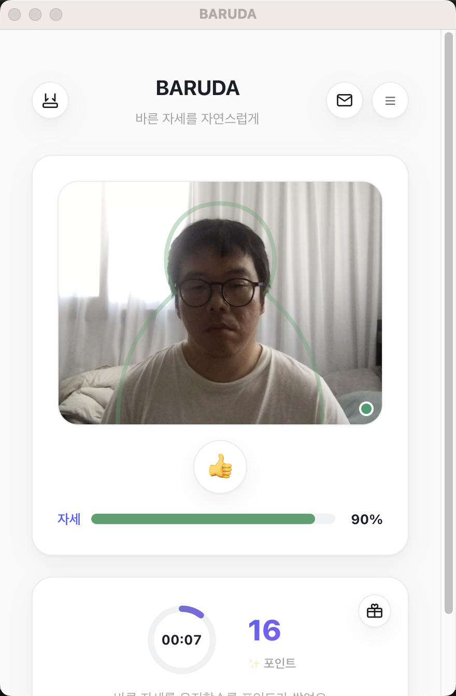

# BARUDA (PostureBlur)

나쁜 자세를 취하면 화면이 점진적으로 흐려지는 시스템 전역 오버레이로, 자연스럽게 바른 자세를 유도하는 Electron 앱입니다.

모든 카메라 처리와 자세 분석은 사용자 PC에서 로컬로만 수행되며, 영상 데이터는 디스크에 저장되거나 외부로 전송되지 않습니다.



---

## 왜 만들었나

하루 종일 모니터를 보고 있으면 목이 조금씩 앞으로 빠지는데, 정작 본인은 그 순간을 잘 못 느낍니다. 스트레칭 알림 앱들은 정해진 시간마다 알림을 띄우지만, 그 알림은 "지금 자세가 나쁜지"와는 아무 상관이 없어서 대부분 무시하거나 꺼버리게 됩니다.

BARUDA의 출발점은 단순합니다 — **알림이 아니라, 지금 이 순간의 자세 자체를 화면에 즉시 반영하자.** 자세가 무너지면 화면이 서서히 흐려지고, 다시 펴면 즉시 선명해집니다. "몇 시니까 스트레칭하라"가 아니라 "지금 자세가 나쁘다"를 몸으로 느끼게 만드는 방식입니다.

여기에 두 가지 원칙을 처음부터 못 박았습니다.

- **프라이버시**: 웹캠 영상은 절대 디스크에 저장되거나 서버로 전송되지 않습니다. 좌표만 추출해서 즉시 버립니다.
- **업무 방해 최소화**: 알림창이나 소리 없이, 화면 블러라는 시각적 신호 하나로만 작동합니다.

자세한 기획 배경은 [PRD.md](./PRD.md), 기술적 설계는 [TRD.md](./TRD.md)에 정리되어 있습니다.

---

## 현재 구현된 기능

- **실시간 자세 인식** — MediaPipe Face Landmarker(코/귀) + Pose Landmarker(어깨/엉덩이)를 함께 사용해 목/몸통 각도를 계산합니다. 점수는 절대각도가 아니라 **기준점 등록 시점 대비 변화량**으로 매겨서, 웹캠이 눈높이에 정확히 있지 않아도(카메라 위치 편향) 정확한 점수가 나옵니다.
- **가이드 아웃라인** — 웹캠 프레임 위에 얼굴+어깨 형태의 연한 실루엣을 표시해, 기준점을 등록하기 전에도 어디에 앉아야 할지 직관적으로 알 수 있게 합니다.
- **자세 점수 시각화** — "자세" 바가 빨강→노랑→초록 연속 그라데이션으로 점수를 표시하고, 95% 이상(완벽 정렬) 시 프레임 테두리와 가이드라인이 초록색으로 반짝입니다.
- **카메라 미검지 안내** — 카메라가 사람을 인식하지 못하면(가려짐, 자리 비움 등) 자세 점수·포인트 적립이 즉시 멈추고, 화면에 빨간 글씨로 "카메라가 닫혀 있습니다"가 표시됩니다. (이전에는 마지막 인식값이 계속 유지되는 문제가 있었습니다.)
- **포인트 시스템** — 자세 점수가 85% 이상으로 유지되는 동안 매초 포인트가 쌓입니다(스트릭 링은 1분에 한 바퀴). 우측 상단 선물 아이콘을 누르면 포인트 사용 방법 안내가 뜹니다.
- **주간 통계 + 캘린더** — 헤더의 햄버거(☰) 버튼을 누르면 최근 7일간의 바른/나쁜 자세 비율을 막대그래프로 보여주고, 그 아래 달력에서 지나간 날짜를 클릭하면 해당 날짜의 기록을 확인할 수 있습니다.
- **하단 미니바** — 상단바의 미니바 아이콘을 누르면 큰 창 대신 화면 하단에 얇은 바만 남습니다. 카메라 추적은 창이 숨겨진 동안에도 계속 동작해서, 바 색상이 실시간으로 초록↔빨강으로 바뀝니다. 마우스로 드래그해서 위치를 옮길 수 있고, 클릭하면 다시 큰 창으로 돌아옵니다. 옆에 사람이 있을 때 카메라 화면을 계속 띄워두기 부담스러운 상황을 위한 기능입니다.
- **문의하기** — 메일 아이콘을 누르면 이름/이메일/문의 내용을 적어 바로 메일로 보낼 수 있는 창이 뜹니다.
- **시스템 전역 블러 오버레이** — 자세가 무너지면 모든 화면 위에 투명 클릭스루 오버레이 창이 블러 처리됩니다. 멀티 디스플레이를 자동 감지합니다.
- **항상 위에 표시** — 메인 창은 다른 앱을 클릭해도 뒤로 밀리지 않고 항상 최상단에 떠 있습니다.
- **라이트 테마 UI** — 화이트 배경 + 인디고 계열 액센트의 미니멀한 디자인.

## 아직 화면에 노출되지 않은 것 (구현은 되어 있음)

로그인(Supabase Auth)과 구독 결제(Stripe)는 코드는 완성되어 있지만(`src/renderer/src/auth`, `src/renderer/src/billing`, `backend/`), 회원가입 없이도 앱을 바로 쓸 수 있도록 현재 `App.tsx`에서 렌더링하지 않고 있습니다. 나중에 필요할 때 다시 연결하면 됩니다. 개발 중에는 `VITE_MOCK_AUTH=true`(`.env.example` 기본값)로 로그인 없이 전체 기능을 테스트할 수 있습니다.

---

## 어떻게 여기까지 왔나 (개발 히스토리)

기획서만 있던 상태에서 지금 형태가 되기까지, 대략 이런 순서로 확장했습니다. (전체 커밋 로그는 `git log` 참고)

1. **기획** — PRD/TRD/TODO 작성. "화면 블러로 자세를 교정한다"는 핵심 아이디어와, 로컬 전용 프라이버시 원칙을 이 단계에서 확정.
2. **뼈대** — Electron + React + TypeScript(electron-vite) 스캐폴딩, 시스템 전역 투명 클릭스루 오버레이 창 구현. 블러를 실제로 화면 전체에 띄울 수 있는지부터 검증.
3. **자세 인식 코어** — MediaPipe Face Landmarker로 코/귀 좌표 추적 → 기준점(baseline) 등록 → 거북목 점수 계산. 이후 Pose Landmarker(어깨/엉덩이 각도)를 추가해 얼굴만으로는 놓치는 상체 기울임까지 반영. 절대각도 대신 **기준점 대비 변화량**으로 점수를 매기도록 바꿔서, 웹캠이 눈높이에 없어도 정확하게 작동하게 함.
4. **저장/구독 기반 마련** — 로컬 SQLite에 자세 타임라인 저장, Supabase 인증 + Stripe 구독 백엔드 구축. (이후 UX상 회원가입 장벽을 없애기 위해 화면에서는 비활성화 — 코드는 남아있음)
5. **UI 재정비** — 다크 스캐폴드 디자인을 걷어내고 라이트 테마 + 미니멀 카드 UI로 전면 재설계. 로그인/구독 게이팅을 풀어서 누구나 바로 자세 인식 기능을 쓸 수 있게 함.
6. **리워드 시스템** — 자세를 잘 유지한 시간에 비례해 포인트가 쌓이는 스트릭 로직 추가. React StrictMode 이중 호출로 포인트가 2배로 적립되던 버그를 잡고, 적립 속도를 30초당 1포인트로 조정.
7. **대시보드** — 주간 자세 통계를 막대그래프로 보여주는 화면 추가. 이후 그래프를 지금의 이중 막대(바른/나쁜 자세) + 축 스타일로 다시 그리고, 날짜를 클릭해 해당일 기록을 볼 수 있는 캘린더를 그 아래 붙임.
8. **안정성 개선** — 카메라가 사람을 인식하지 못했을 때 마지막 인식값이 그대로 유지되던 문제를 발견. 감지 실패 시 상태를 즉시 초기화하도록 고쳐서, 자리를 비우거나 카메라가 가려지면 포인트 적립과 점수 표시가 바로 멈추게 함.
9. **부가 기능** — 문의하기(메일 발송) 모달, 포인트 사용 안내 모달 추가.
10. **미니바** — 자세 화면을 계속 띄워두기 부담스러운 상황을 위해 하단 미니바 기능 추가. 개발 과정에서 시행착오가 있었습니다: 처음엔 네이티브 최소화 버튼(노란 신호등)을 가로채려다 macOS의 always-on-top 창과 충돌해 창이 풀스크린으로 고정되는 버그가 발생 → 트리거를 별도 아이콘 버튼으로 변경. 이후 미니바를 드래그 가능하게 만들 때도 BrowserWindow의 네이티브 `movable` 옵션이 같은 종류의 충돌을 일으켜서, 마우스 이동을 직접 추적해 창 위치를 옮기는 방식으로 다시 구현. 창이 숨겨진 동안 자세 추적 루프(`requestAnimationFrame`)가 완전히 멈춰서 미니바 색이 굳어버리는 문제도 발견해, `setTimeout` 기반으로 바꿔 백그라운드에서도 계속 갱신되게 함.

---

## 기술 스택

- Electron + React + TypeScript (electron-vite)
- MediaPipe Face Landmarker + Pose Landmarker (로컬 웹캠 랜드마크/포즈 추출)
- SQLite (로컬 자세 타임라인 저장, `better-sqlite3`)
- Supabase Auth + Stripe 구독 (클라우드 백엔드, `backend/` — 현재 UI에는 미연결)

## 개발

```bash
npm install
cp .env.example .env   # 기본값(VITE_MOCK_AUTH=true)이면 Supabase/Stripe 계정 없이 바로 실행 가능
npm run dev
```

## 빌드 및 배포

```bash
npm run build
npm run build:win   # Windows
npm run build:mac   # macOS
npm run build:linux # Linux
```

빌드 결과물은 `dist/`에 생성됩니다. 코드 서명이 안 되어 있어(Apple Developer 계정 필요) macOS에서 처음 실행 시 "확인되지 않은 개발자" 경고가 뜰 수 있습니다 — 앱을 우클릭 → 열기로 실행하면 됩니다.

다른 사람에게 배포하려면 dmg/exe를 만들어 GitHub Releases에 올리는 방법을 추천합니다:

```bash
gh release create v0.1.0 dist/BARUDA-0.1.0.dmg --title "BARUDA v0.1.0" --notes "..."
```

또는 소스를 그대로 clone해서 `npm install && npm run dev`로 실행할 수도 있습니다(개발자용).

## 클라우드 백엔드 (Supabase + Stripe, 현재 미연결)

구독 결제는 `backend/`의 별도 NestJS 서버가 담당합니다. Electron 앱은 Supabase anon key로 로그인/구독 상태 조회(RLS로 본인 행만 접근)까지만 하고, Stripe 시크릿 키와 Supabase 서비스 롤 키가 필요한 작업(체크아웃 세션 생성, 웹훅 처리)은 전부 백엔드가 담당합니다.

1. Supabase 프로젝트 생성 후 `backend/supabase/migrations/0001_init.sql`을 SQL Editor에서 실행 (profiles/subscriptions 테이블 + RLS)
2. `backend/.env.example`을 `backend/.env`로 복사하고 Supabase 서비스 롤 키, Stripe 시크릿 키·가격 ID를 채운 뒤 `npm install && npm run start:dev`
3. Stripe 대시보드에서 웹훅 엔드포인트를 `<백엔드 주소>/webhooks/stripe`로 등록하고, 서명 시크릿을 `STRIPE_WEBHOOK_SECRET`에 채우기
4. 루트 `.env`의 `VITE_SUPABASE_URL` / `VITE_SUPABASE_ANON_KEY` / `VITE_BACKEND_URL`을 채우기
5. `src/renderer/src/App.tsx`에서 `AuthGate`/`BillingPanel`을 다시 렌더링하도록 연결

> 실제 Supabase/Stripe 키가 없는 상태라 위 흐름은 스캐폴딩 상태입니다.

## 프로젝트 구조

- `src/main` — Electron 메인 프로세스
  - `overlayWindow.ts` — 멀티 디스플레이 투명 클릭스루 블러 오버레이
  - `miniBarWindow.ts` — 하단 미니바 창 생성/표시/이동
  - `postureStore.ts` — 로컬 SQLite 자세 타임라인 저장 (5분 단위 집계)
  - `index.ts` — 메인 창(항상 위 고정) 생성, IPC 핸들러
- `src/preload` — 렌더러에 노출되는 IPC 브릿지 (`index`, `overlay`, `minibar`)
- `src/renderer/src`
  - `posture/` — MediaPipe Face/Pose Landmarker, 자세 점수 계산, 웹캠 UI, 포인트/스트릭
  - `dashboard/` — 주간 자세 통계 차트 + 캘린더
  - `minibar/` — 하단 미니바 UI (드래그, 클릭 복원, 실시간 색상)
  - `auth/` — Supabase 로그인/세션 관리 (현재 미연결)
  - `billing/` — 구독 상태 조회 및 Stripe Checkout 시작 (현재 미연결)
  - `lib/` — Supabase 클라이언트, 개발용 mock 인증 플래그
- `backend/` — Supabase 서비스 롤 / Stripe 시크릿 키가 필요한 작업 전용 NestJS API

## 문서

- [PRD.md](./PRD.md) — 제품 요구사항 문서
- [TRD.md](./TRD.md) — 기술 요구사항 문서
- [TODO.yaml](./TODO.yaml) — 작업 항목 및 우선순위

## 주의사항

- 카메라 권한은 각 사용자 PC에서 최초 실행 시 macOS/Windows가 개별적으로 요청합니다.
- Stripe VoIP/결제 비용 구조를 감안한 수익 모델 설계는 아직 확정 전입니다.

## License

MIT
